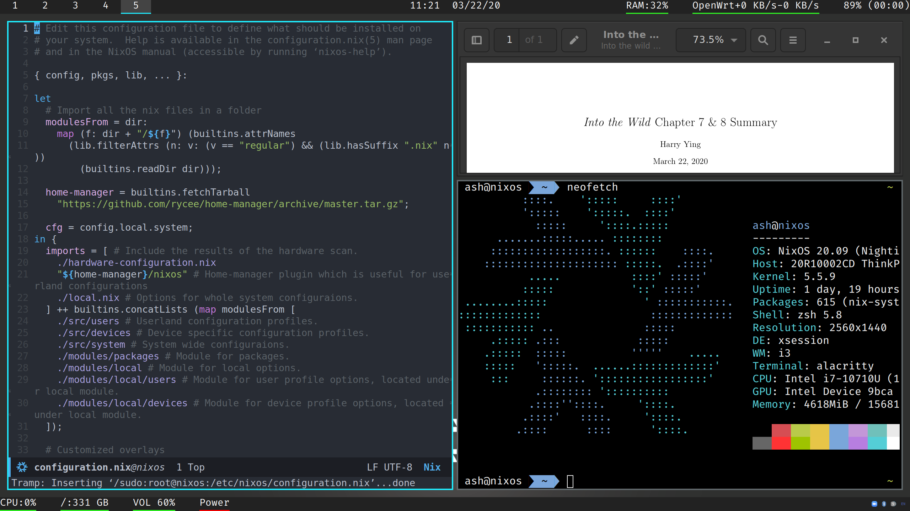

# NixOS

A fully automated replicable nixos configuration set. Tested on Virtualbox and ThinkPad X1 Carbon 7th Gen. It should be working on any x86 machine.

# What does it do?
It features:
- typed configuration options for this configuration. (You could tune a little for this configuration set).
- A light saber colored i3 + polybar workflow.
- GTK with builtin dark variant.
- Full-disk encryption including `/boot`. Support hibernate.
- Working Howdy (Windows Hello like login service) on X1 Carbon 7th Gen
- Transparent proxy and de-polluted DNS server using Clash (support shadowsocks, Vmess, trojan). rules are written in order to maximize the performance.
- <kbd>CapsLock</kbd> as <kbd>Ctrl</kbd>! No emacs pinky anymore! (Surely I am
  an emacs user).
- zsh with oh-my-zsh builtin, in addition to a git plugin which makes your life
  easier.
- An almost automated one-liner installation script.

# How do I install it?
Boot in NixOS LiveCD, and then:

``
curl -Ls https://github.com/LEXUGE/nixos/raw/master/install.sh | bash
``

Follow the instructions and there you go.

If you want to use `clash`, please create `secrets/clash.yaml` (You could follow the `secrets/clash.yaml.example` as a guideline).

If you want hibernate to work, please follow the instructions under `share.swapResumeOffset` in `local.nix`.

## Note
If you are not on a NVMe SSD, please edit the script to fit `"${device}p2"` into `"${device}2"` (so does `"${device}p1"`).

If you are outside of Mainland China, please edit the script to use official binary cache only instead of TUNA's. You may also need to adapt the `binaryCaches` setting in `system/options.nix` to your own network.

# Structure of the configuration
The system configuration could be split up into three pieces, system-wide, user-land, and device-specifications.
- User-land `users/`: I would do some personal configuration here, this would include which shell to use for specific user, what packages to install, etc.
- Device-specifications `devices/`: This would include some non-universal device specific configurations like `TLP` power management and `fprintd` fingerprint auth.
- System: Rest of them are a re-usable system with my personal flavor added (e.g. transparent proxy for better networking experience).

# Security details
As for me, I am on my best to ensure that the system is convenient to use and secure. But here are some concerns:
- `services.fstrim.enable` is set to `true` which means that attacker may be able to perceive the data usage of the fully encrypted disk.
- `clash` runs under root in systemd for UDP redir.
- `howdy` is not suggested to use if you need to ensure high level security due to the potentiality of spoofing.
- There is keyfile added to `/` partition encryption in order to eliminate the twice keying in of the LUKS passphrase. This may imply security concerns.

# How do I steal it?
It's actually not well-structured for stealing. But here are some
instructions:
- If you want to use my packaged
  [simple-obfs](https://github.com/shadowsocks/simple-obfs), just grab
  `packages/simple-obfs.nix` (Removed after first release).
- See `proxy.nix` if you want to use transparent proxy.
- See `packages/ir_toggle.nix`, `packages/howdy.nix`, `modules/ir_toggle.nix`, `modules/howdy.nix` if you want to use Howdy on X1 Carbon 7th Gen (20R1). (**Tip:** if you are not on X1 Carbon 7th Gen, you would probably not need `ir_toggle` in order to get it work.)

# See also
[config](https://github.com/LEXUGE/config) for my emacs and other configs (may
integrate into this repository later).

# Acknowledgments
Thanks to following repositories:
- [Jollheef - localhost](https://github.com/jollheef/localhost). It inspired me
the general structure of the config and how to use home-manager.
- [Ninlives - nixos-config](https://github.com/Ninlives/nixos-config). It
  inspired me to implement the transparent proxy functionality.
